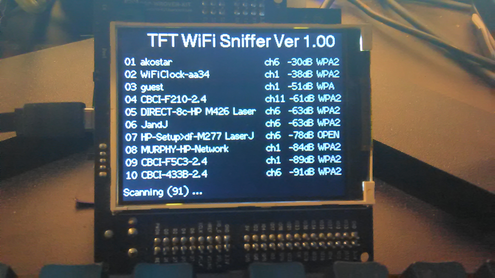

# TFT Sniff

## This is an example project for the WROVER TFT board.

 It will display the WiFi stations that are currently nearby.
 
  The example contains the display driver, the wifi scanning code, and
a timer loop for continuous scanning. Lots of goodies also included:

 * GUI primitives,  fonts, basic shapes, (rect / line .. etc)
 * Fonts for different sizes 
   **     small, 
   ** medim, 
   ** large .. double large
 * Font generator. (compiles on linux)
 * Wifi initializer / scanner
 
  The TFT library is custom made with double buffering. It performs really 
  fast compared to the single buffered version. See code for driving the TFT.
  Notice, the display code talks to two halfs of the display sequentially.
  
  Enjoy,    
 
   
      
  Peter 

